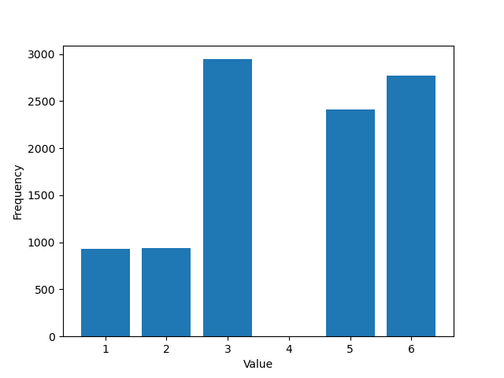

# Exercise 1: 

## 1. Motivation
This exercise implements a custom random selection function for a given array `arr = [3, 6, 5, 2, 1, 1, 3]`. The goal is to return a random number from the array such that the probability of selecting a number is directly proportional to its value.
For example, given `arr = [3, 6, 5, 2, 1, 1, 3]`, the sum of all elements is `21`. The probability of selecting an element at a specific index is `value / sum`:

- Index 0 (Value `3`): `3/21`
- Index 1 (Value `6`): `6/21`
- Index 2 (Value `5`): `5/21`
- Index 3 (Value `2`): `2/21`
- Index 4 (Value `1`): `1/21`
- Index 5 (Value `1`): `1/21`
- Index 6 (Value `3`): `3/21`

If you focus on uniquely selected values instead of indices: 
- The probability of getting the number `6` is `6/21`.
- The probability of getting the number `3` is `(3+3)/21 = 6/21` (since it appears twice).


## 2. Prerequisites
- **Conda** (Miniconda or Anaconda) installed on your system.
- **Python 3.10**
- See `requirements.txt` for python library dependencies (e.g. `matplotlib`).

## 3. How to run

### 3.1. Create virtual environment
```bash
conda create -n ex1 python=3.10 -y
```

### 3.2. Activate virtual environment
```bash
conda activate ex1
```

### 3.3. Install libraries
```bash
pip install -r requirements.txt
```

### 3.4. Run the code
```bash
python ex1.py
```
## 4. Result


### Explanation:
The Bar Chart above illustrates the frequency distribution of each number selected after running the `get_random` function **10,000 times**. 

As calculated in the Motivation section, the theoretical probabilities roughly translate to the following expected bounds for 10,000 iterations:
- **Number 6** and **Number 3** (both bounded at $6/21 \approx 28.57\%$): Should appear around **2,850 times** each.
- **Number 5** ($5/21 \approx 23.81\%$): Should appear around **2,380 times**.
- **Number 2** and **Number 1** (both bounded at $2/21 \approx 9.52\%$): Should appear around **950 times** each *(Note: The number 1 also appears twice in the array `[1, 1]` so its total probability acts identically to the number 2).*

The chart visually confirms that our custom random function successfully forces the occurrence of each number to be **directly proportional** to its value in the array.
