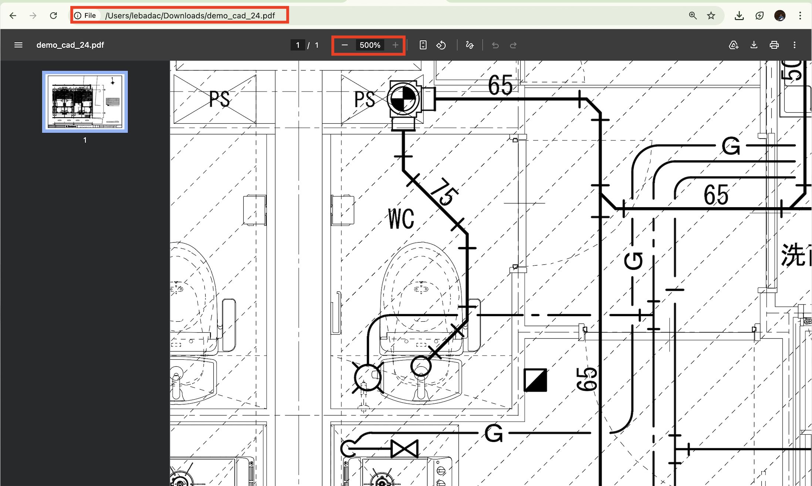
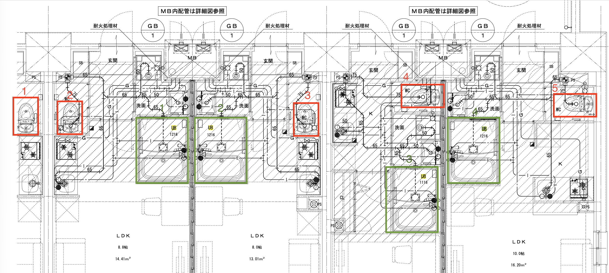
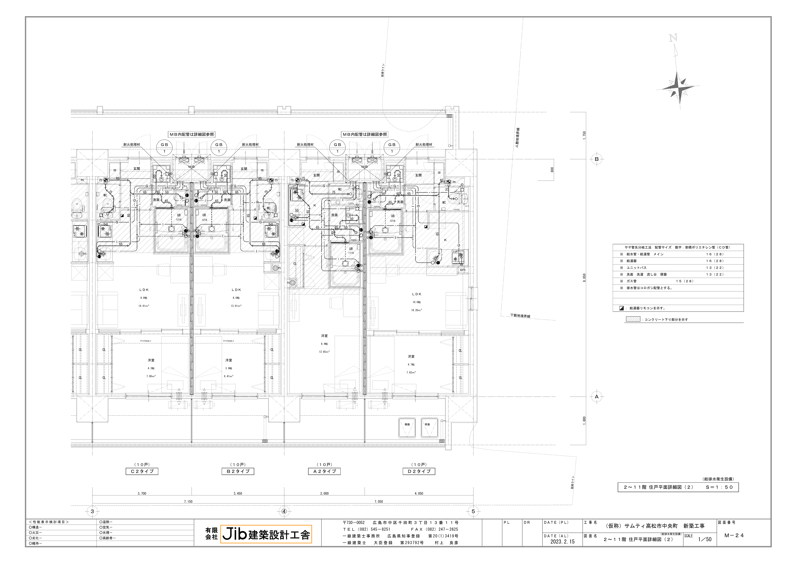
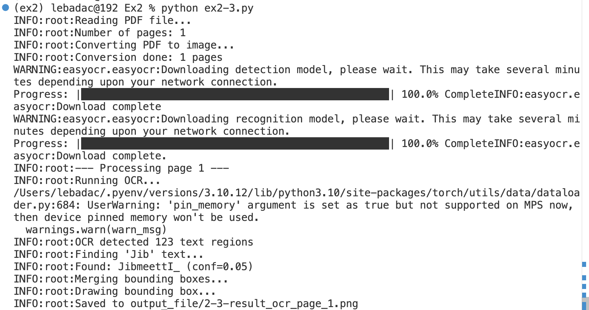

# Report - Exercise 2

### 2.1/ Hãy download hình vẽ trên về máy tính của bạn và phóng to hình vẽ ít nhất 500%, xác nhận hình vẽ bằng mắt thường.

**Observation:**
At the top of the image, we can see:
- The local file path: `file:///Users/lebadac/Downloads/demo_cad_24.pdf`
- A **500% zoom level**.

> **Conclusion**: The image has been downloaded and zoomed to 500%. This indicates that I have successfully completed this exercise.

---

### 2.2/ Dùng mắt thường hãy đếm xem trong hình vẽ có mấy nhà vệ sinh (các phòng ghi ký hiệu “WC"), mấy nhà tắm (UB - Unit Bath).

**Observation:**
- There are 5 WCs, which are highlighted in red.
- There are 4 UBs, which are highlighted in green.

> **Conclusion**: Based on visual inspection, there are 5 WCs and 4 UBs in this image. This indicates that I have successfully completed this exercise.

### 2.3/ Dùng thư viện Python để đọc file PDF trên và xác định vùng có tên (title) bản vẽ (vùng có chữ Jib ở cuối bản vẽ). Viết chương trình output ra ảnh chứa bounding box highlight hình chữ nhật chứa tên bản vẽ (ảnh chứa hình chữ nhật màu da cam bao quanh hình chữ nhật chứa tên bản vẽ).

**Observation:**
When executing the code, the `easyocr` model successfully scans the document and detects the bounding box corresponding to the sequence "Jib". The program then accurately draws an orange rectangle from the top-left to the bottom-right corner of the detected text.

> **Conclusion:** The generated image confirms that the orange bounding box perfectly encloses the specified text region. This demonstrates that the exercise has been completed successfully.